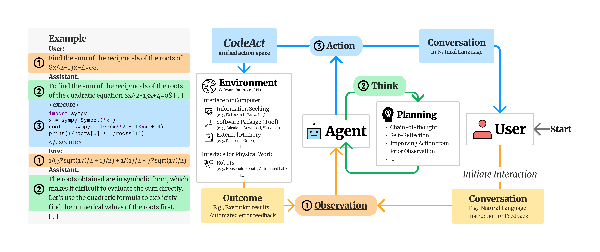

<!-- PROJECT LOGO -->
<br />
<p align="center">
  <h3 align="center">CodeActAgent-Gradio</h3>

  <p align="center">
   		利用 Gradio 使 CodeActAgent-Mistral-7b 成为一个可交互运行的 Code-LLM 教学代理机器人 🤖
    <br />
  </p>
</p>

[In English](README_EN.md)

## 简要引述

### 背景
[Executable Code Actions Elicit Better LLM Agents](https://github.com/xingyaoww/code-act)是一个使用可执行代码的工程，
将LLM代理的行动整合到代码执行程序（CodeAct）中，其与 Python 解释器集成。 <br/>
CodeAct 可以执行代码操作并动态修改先前的操作或根据新的观察发出新的操作（例如，代码教学、代码纠错、运行代码得到执行结果），可实现与用户的动态交互和程序执行。



[原始工程](https://github.com/xingyaoww/code-act)，使用Huggingface ChatUi并且具有相对复杂的前后端结构。 <br/>
本项目旨在简化原有项目结构，仅使用Llama-cpp和gradio，从量化模型出发，以相对简单的结构实现了CodeActAgent作为可运行、可交互的Code LLM教学代理功能使用。

## 安装和运行结果
### 安装
```bash
pip install -r requirements.txt
```
推荐安装llama-cpp-python GPU版本以获得更好体验。
### 运行
启动名为 "code_act_agent_gradio_demo.ipynb" 的jupyter notebook，运行所有单元格。 <br/>
在浏览器访问 http://127.0.0.1:7860 或者 gradio 提供的开放分享接口。<br/>
下面通过几个视频介绍如何与本工程的例子进行交互。

### 运行结果
#### 简单代码教学
* 1 除法函数:<br/>
```txt
Give me a python function give the divide of number it self 10 times.
```

https://github.com/svjack/CodeActAgent-Gradio/assets/27874014/7cc55406-dc58-42dd-bab5-2c8b0cdb42e1

聊天上下文中的 "Observation:" 表明由LLM定义的函数在Python解析器中的运行结果。 这表明本工程具有代码可运行和可交互式运行的能力。
* 2 numpy 教学:<br/>
```txt
teach me how to use numpy.
```

https://github.com/svjack/CodeActAgent-Gradio/assets/27874014/6704ea21-4dd1-429a-9fc7-a348d24c8b83

#### 特殊目的函数定义

* 1 pollinations.ai 提供的图像下载函数: (可以根据提示词，下载 stable diffusion 图像)<br/>
```txt
Write a python code about, download image to local from url, the format as :
            url = f'https://image.pollinations.ai/prompt/{prompt}'
            where prompt as the input of download function.
```

https://github.com/svjack/CodeActAgent-Gradio/assets/27874014/6085a21b-5ba1-4c36-8c9d-0f373474fd64

在本例中，用户可以借助LLM定义 download_image 函数，并将蜜蜂图像下载到本地。 <br/>
我们可以看到，LLM有能力自行纠正输出的错误。<br/>
当agent保存没有扩展名的图像时，用户可以使用自然语言命令程序修改本地文件的扩展名，
这表明LLM具有可执行的代理能力而不仅仅是教学助手。

#### 统计函数和作图

* 1 简单箱形图<br/>
```txt
Plot box plot with pandas and save it to local.
```


https://github.com/svjack/CodeActAgent-Gradio/assets/27874014/62d7788c-3580-4a5b-8c57-6f19f5ea922e

* 2 线性回归原理和数据作图<br/>
```txt
Draw a picture teach me what linear regression is.
```


https://github.com/svjack/CodeActAgent-Gradio/assets/27874014/d587bf10-7051-46dc-aba0-7e1befed5d54


* 3 金融波动数据模拟 <br/>
```txt
Write a piece of Python code to simulate the financial transaction process and draw a financial images chart by lineplot of Poisson process.
```

https://github.com/svjack/CodeActAgent-Gradio/assets/27874014/6d628900-7362-4c84-8563-327be3194b7b

<br/>

### 注意
* 1 由于随机性，每次运行的结果可能会有所不同，这鼓励积极探索更多方式与LLM灵活交互，这也更有趣。
* 2 gradio页面中的示例提供了一些方便的指令以方便与模型交互，例如 <br/>
  Give me the function defination. 💡<br/>
  Correct it. ☹️❌<br/>
  Save the output as image 🖼️ to local. ⏬<br/>
  Good Job 😊<br/>
  你可以在上面的视频中发现它们的用处。
* 3 聊天上下文的最长长度在notebook中设定为3060，如果你需要更长的聊天轮数，请尝试手动增加，这依赖于你的显存大小。
* 4 我建议您在 GPU 上运行演示（10GB GPU 内存就足够了，所有示例都在单个 GTX 1080Ti 或 GTX 3060 上进行了测试）
  
### 使用的模型
|模型名称 | 模型类型 | HuggingFace 模型链接 |
|---------|--------|--------|
| xingyaoww/CodeActAgent-Mistral-7b-v0.1 | Mistral-7b 8bit quantization | https://huggingface.co/xingyaoww/CodeActAgent-Mistral-7b-v0.1 |

<br/><br/>

### Python运行时框架替代品
https://github.com/e2b-dev/code-interpreter

<!-- CONTACT -->
## Contact

<!--
Your Name - [@your_twitter](https://twitter.com/your_username) - email@example.com
-->
svjack - https://huggingface.co/svjack - svjackbt@gmail.com - ehangzhou@outlook.com

<!--
Project Link: [https://github.com/your_username/repo_name](https://github.com/your_username/repo_name)
-->
Project Link:[https://github.com/svjack/CodeActAgent-Gradio](https://github.com/svjack/CodeActAgent-Gradio)

<!-- ACKNOWLEDGEMENTS -->
## Acknowledgements
* [xingyaoww/code-act](https://github.com/xingyaoww/code-act)
* [llama-cpp-python](https://github.com/abetlen/llama-cpp-python)
* [gradio](https://github.com/gradio-app/gradio)
