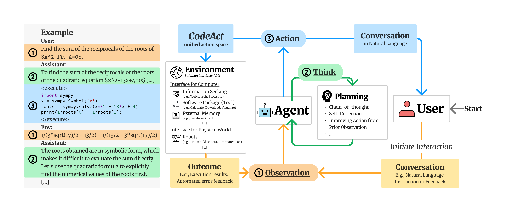

<!-- PROJECT LOGO -->
<br />
<p align="center">
  <h3 align="center">CodeActAgent-Gradio</h3>

  <p align="center">
   		Use CodeActAgent-Mistral-7b by gradio as runable Code-LLM agent.
    <br />
  </p>
</p>

[中文介绍](README.md)

## Brief introduction

### BackGround
[Executable Code Actions Elicit Better LLM Agents](https://github.com/xingyaoww/code-act) is a repo that use executable code 
to consolidate LLM agents’ actions into a unified action space (CodeAct). Integrated with a Python interpreter. <br/>
CodeAct can execute code actions and dynamically revise prior actions or emit new actions upon new observations 
(e.g., code execution results) through multi-turn interactions.



[The original repo](https://github.com/xingyaoww/code-act), use Huggingface Chatui and Has a relatively complex front-end and back-end structure. <br/>
This project aims to simplify the original project structure, by simply using Llama-cpp and gradio.<br/>
Starting from quantified weights, it implements the use of CodeActAgent as a runnable and interactive teaching Code LLM function with a relatively simple structure.


## Installation and Running Results
### Install
```bash
pip install -r requirements.txt
```
### Running
Lanuch the jupyter notebook named "code_act_agent_gradio_demo.ipynb" <br/>
Visit http://127.0.0.1:7860 in browser or public url provided by gradio.

### Running Results
#### Simple code teaching
* 1 divide number function:<br/>
```txt
Give me a python function give the divide of number it self 10 times.
```

https://github.com/svjack/CodeActAgent-Gradio/assets/27874014/7cc55406-dc58-42dd-bab5-2c8b0cdb42e1

"Observation:" in the chat context indicate the run conclusion of function, defined by LLM. This shows the runable and interactive ability of demo.
* 2 teach numpy:<br/>
```txt
teach me how to use numpy.
```

https://github.com/svjack/CodeActAgent-Gradio/assets/27874014/6704ea21-4dd1-429a-9fc7-a348d24c8b83

#### Special purpose function definition

* 1 image download function by pollinations.ai: (can retrieve image in stable diffusion style)<br/>
```txt
Write a python code about, download image to local from url, the format as :
            url = f'https://image.pollinations.ai/prompt/{prompt}'
            where prompt as the input of download function.
```

https://github.com/svjack/CodeActAgent-Gradio/assets/27874014/6085a21b-5ba1-4c36-8c9d-0f373474fd64

In this example, user can define the download_image function and download the bee image into local. <br/>
And the LLM have ability to correct the error output make by itself.<br/>
When agent save image without extension name, user can modify the extension of local files using a natural language command program,
which indicate the LLM have agent ability rather than just a teacher.

#### Statistical functions and graphing

* 1 simple box plot<br/>
```txt
Plot box plot with pandas and save it to local.
```


https://github.com/svjack/CodeActAgent-Gradio/assets/27874014/62d7788c-3580-4a5b-8c57-6f19f5ea922e

* 2 linear regression principle and data plot<br/>
```txt
Draw a picture teach me what linear regression is.
```


https://github.com/svjack/CodeActAgent-Gradio/assets/27874014/d587bf10-7051-46dc-aba0-7e1befed5d54


* 3 financial transaction process simulation <br/>
```txt
Write a piece of Python code to simulate the financial transaction process and draw a financial images chart by lineplot of Poisson process.
```

https://github.com/svjack/CodeActAgent-Gradio/assets/27874014/6d628900-7362-4c84-8563-327be3194b7b

<br/>

### Note
* 1 Because of the randomness, the results of each run may be different, which encourages active exploration of more ways to flexibly interact with LLM, which is also more interesting.
* 2 the example in gradio page provide some convenient instructions are provided to facilitate interaction with the model, such as <br/>
  Give me the function defination. 💡<br/>
  Correct it. ☹️❌<br/>
  Save the output as image 🖼️ to local. ⏬<br/>
  Good Job 😊<br/>
  You can find the usage of them in above videos.
* 3 I recommand you run the demo on GPU (10GB gpu memory is enough, all examples have tested on single GTX 1080Ti or GTX 3060) <br/><br/>

### LLM Model
|Name | Type | HuggingFace Model link |
|---------|--------|--------|
| xingyaoww/CodeActAgent-Mistral-7b-v0.1 | Mistral-7b 8bit quantization | https://huggingface.co/xingyaoww/CodeActAgent-Mistral-7b-v0.1 |

<br/><br/>

<!-- CONTACT -->
## Contact

<!--
Your Name - [@your_twitter](https://twitter.com/your_username) - email@example.com
-->
svjack - https://huggingface.co/svjack - svjackbt@gmail.com - ehangzhou@outlook.com

<!--
Project Link: [https://github.com/your_username/repo_name](https://github.com/your_username/repo_name)
-->
Project Link:[https://github.com/svjack/CodeActAgent-Gradio](https://github.com/svjack/CodeActAgent-Gradio)

<!-- ACKNOWLEDGEMENTS -->
## Acknowledgements
* [xingyaoww/code-act](https://github.com/xingyaoww/code-act)
* [llama-cpp-python](https://github.com/abetlen/llama-cpp-python)
* [gradio](https://github.com/gradio-app/gradio)
